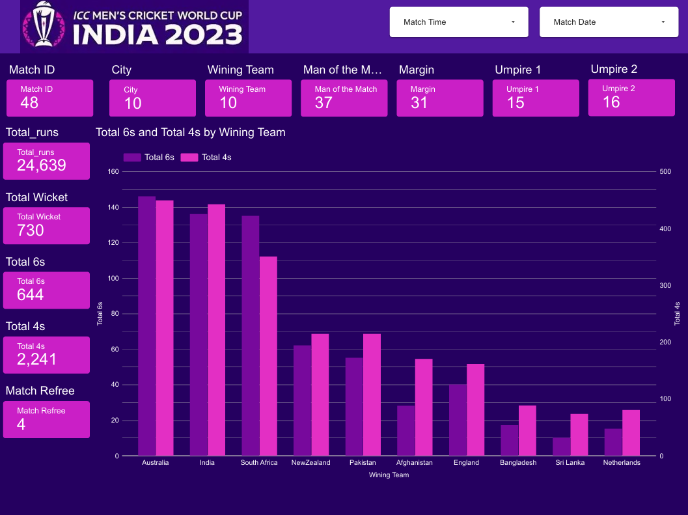
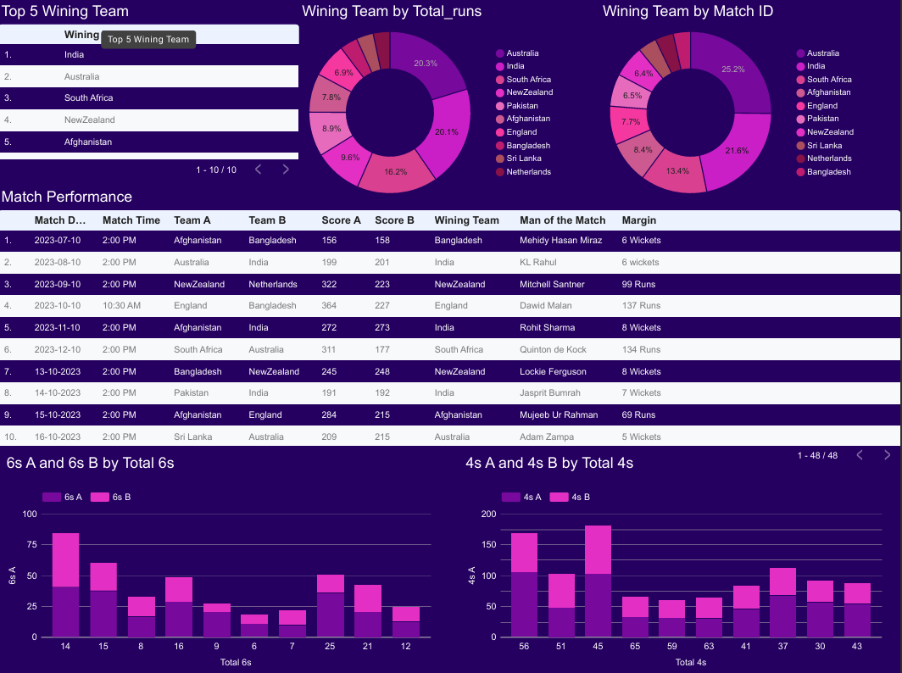
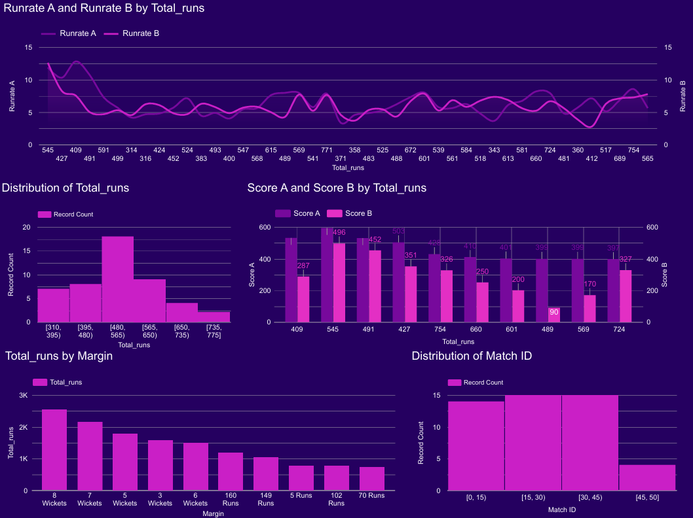
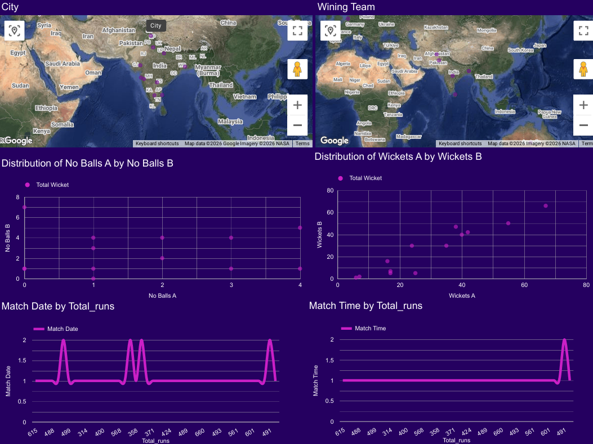
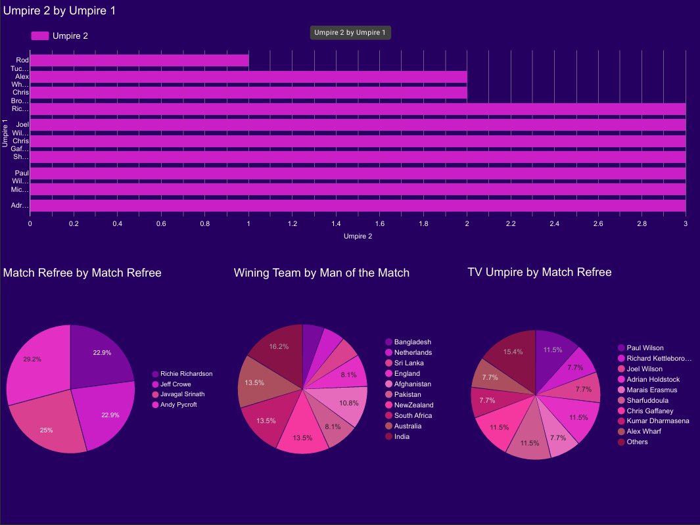
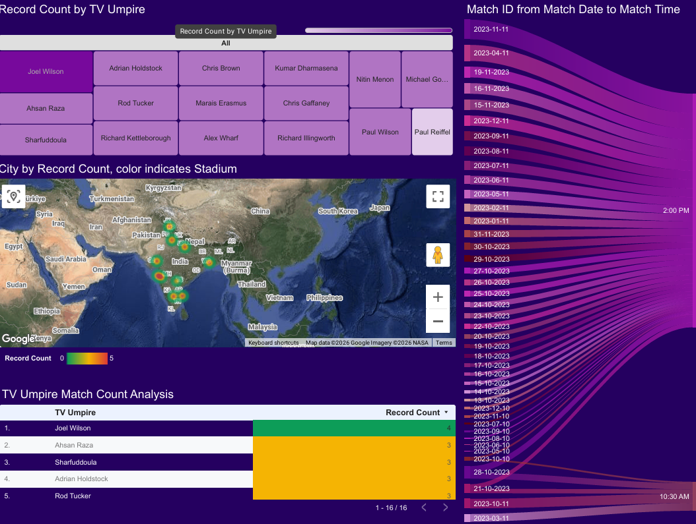

# 🏏 Cricket Tournament Analytics Dashboard 📊

---

## 📌 Project Overview

Cricket is a data-rich sport where match outcomes, team strategies, and player performances depend on multiple factors such as scoring patterns, wickets, venues, and match conditions.  

Analyzing these factors helps uncover hidden insights and performance trends across tournaments.

In this project, I performed an **end-to-end Cricket Tournament Data Analysis** to explore:
- Team performance
- Scoring behavior
- Boundary trends
- Match outcomes
- Venue impact

---

## 🎯 Objectives

- Provide a complete overview of the tournament  
- Analyze team-wise performance and consistency  
- Study scoring patterns and run distribution  
- Examine boundary (4s & 6s) and wicket trends  
- Evaluate match outcomes and key KPIs  
- Analyze venue impact on match results  

---

## 🛠️ Tools & Technologies

- **Google Sheets** → Data Cleaning & Preparation  
- **Looker Studio** → Interactive Dashboard Creation  
- **GitHub** → Documentation & Version Control  

---

## 📊 Dataset

🔗 Source: [Cricket World Cup 2023 Dataset](https://www.kaggle.com/datasets/maulikpatel1930/cricket-world-cup-2023)

📁 Raw Data: `RawDataset/`  
📁 Cleaned Data: `CleanedDataSet/`  

The dataset includes match-level, team-level, and performance-based statistics across the tournament.

---

## 📂 Project Structure

Cricket-Tournament-Analytics/
│
├── RawDataset/
├── CleanedDataSet/
├── Dashboard/
│ ├── Tournament Overview.png
│ ├── Team Performance.png
│ ├── Scoring Analysis.png
│ ├── Boundary & Wicket Insights.png
│ ├── Match Outcome Analysis.png
│ ├── Venue Analysis.png
│
└── README.md

---

## 📊 Dashboard Overview

### 📄 1. Tournament Overview
- Total matches  
- Teams participated  
- Total runs scored  
- Total wickets taken  

---

### 📄 2. Team Performance Analysis
- Matches played & won  
- Win percentage  
- Total runs scored  
- Total wickets taken  

---

### 📄 3. Scoring & Run Analysis
- Runs per match  
- Average innings score  
- Run distribution across overs  

---

### 📄 4. Boundary & Wicket Insights
- Fours & sixes distribution  
- Team-wise boundary contribution  
- Wicket trends  

---

### 📄 5. Match Outcome Analysis
- Win/Loss patterns  
- Margin of victory  
- Team consistency  

---

### 📄 6. Venue Analysis
- Stadium-wise match count  
- Average runs per venue  
- Toss impact  

---

## 🔍 Key Insights

- Certain teams consistently outperform others  
- High-scoring matches depend on venue  
- Boundaries increase in middle & death overs  
- Teams batting second show different patterns  
- Venue conditions strongly impact results  

---

## 🏁 Conclusion

This project demonstrates how data analytics can uncover meaningful insights from cricket tournaments.

By analyzing team performance, scoring trends, and venue effects, we gain a deeper understanding of match dynamics.

Interactive dashboards make insights easy to explore and visually engaging.

---

## 👤 Author

**Koyal Chakraborty**
